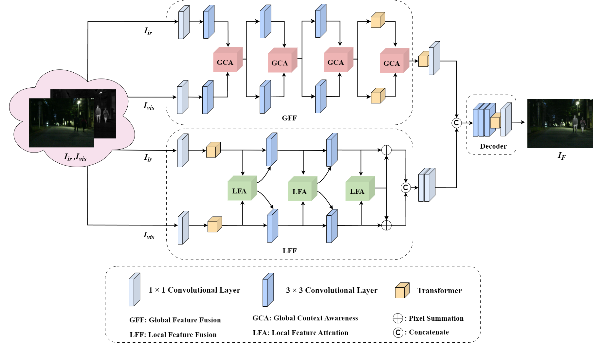
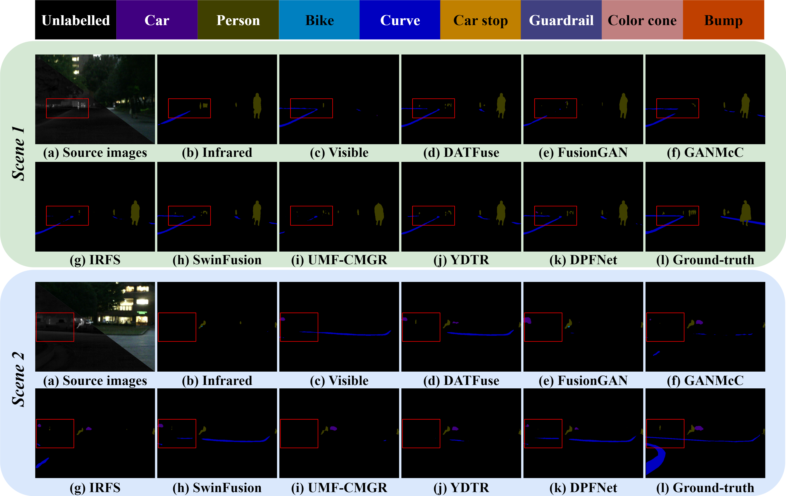

# A Dual-Branch Progressive Network with Spatial-Frequency Constraint for Image Fusion

This repository contains the code and resources associated with our paper titled "A Dual-Branch Progressive Network with Spatial-Frequency Constraint for Image Fusion". Please note that the paper is currently under review for publication.

### Illustration of our DPNet model



## Training

- Train the model with default arguments by running

```
python train.py
The pretrained weights from [HERE](https://1drv.ms/f/s!Al2dMJC6HUgQrJJ7oQyrDZz-FgY9Cw?e=IuqkUC).
```

## Test

python test.py

## Results

### Quantitative fusion results


### Quantitative fusion results

Infrared-Visible Image Fusion


Medical Image Fusion


MM detection


MM segmentation


### Semantic segmentation evaluation Results



## Citation

If you find this code or research helpful, please consider citing our paper:

```BibTeX
@article{WANG2025DPNet,
title={A Dual-Branch Progressive Network with Spatial-Frequency Constraint for Image Fusion},
author={Wang, Zenghui and Song, wenhao and Xing, Xuening and Liu, Lina and Zhu Xianxun},
journal={under_review}
year={2025},
}
```

Please note that this citation is a placeholder and will be updated with the actual citation information once the paper is accepted and published.
